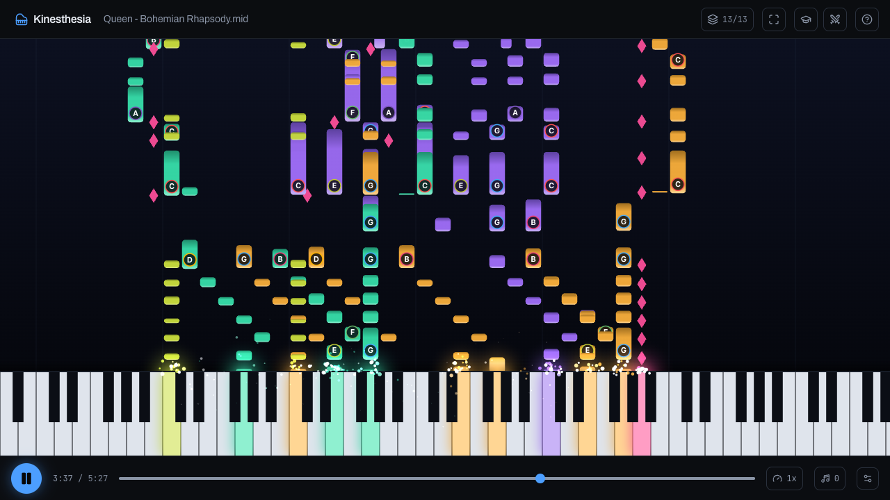

# Kinesthesia

[](https://github.com/h4ks-com/kinesthesia/actions/workflows/ci.yml)
[](https://github.com/h4ks-com/kinesthesia/actions/workflows/docker.yml)
[](https://github.com/h4ks-com/kinesthesia/pkgs/container/kinesthesia)
[](https://github.com/h4ks-com/kinesthesia/pkgs/container/kinesthesia)
[](LICENSE)



A piano roll for the web, inspired by [Synthesia](https://synthesiagame.com/).
Search a song and its MIDI falls onto an 88 key piano to watch, learn, or play
someone else.

Live at [kinesthesia.h4ks.com](https://kinesthesia.h4ks.com).

## Run it

```
cp .env.example .env
bun install
bun run dev
```

With Docker, built here:

```
docker compose up
```

or from the published image, built for amd64 and arm64:

```
docker run -p 3000:3000 -v kinesthesia:/app/data ghcr.io/h4ks-com/kinesthesia:latest
```

`.env.example` documents every setting.

## API

The API documents itself at `/api/docs`, with the OpenAPI spec at
`/api/openapi.json`.

## MCP

The same tools run over MCP at `/api/mcp` (streamable HTTP), so an agent can
search for songs, read a file's length and tracks, and build player links. Add
it to a client:

```
claude mcp add --transport http kinesthesia https://kinesthesia.h4ks.com/api/mcp
```

or with JSON config:

```json
{
  "mcpServers": {
    "kinesthesia": { "type": "http", "url": "https://kinesthesia.h4ks.com/api/mcp" }
  }
}
```

Swap in `http://localhost:3000/api/mcp` when running locally.

MIDI files come from several sources, listed at `/sources`. A `?url=` player
link also plays a direct `.mid` from the app's own origin or an origin set in
`MIDI_TRUSTED_ORIGINS`; `player_link` accepts such a url too.
